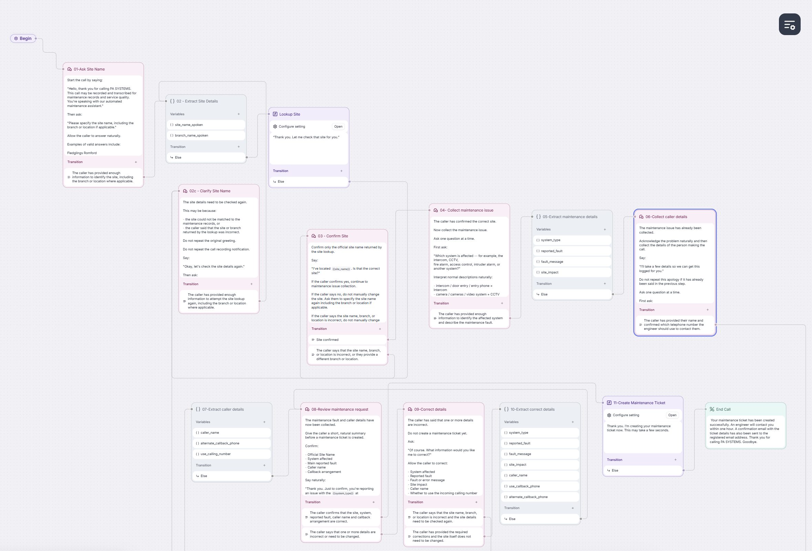
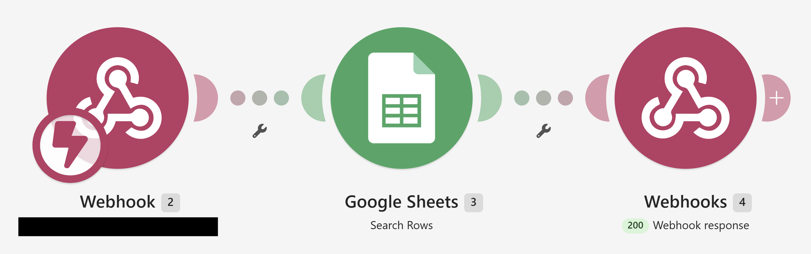
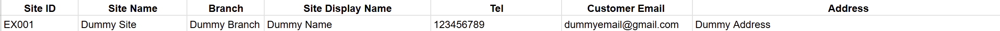
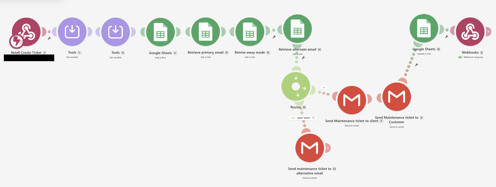
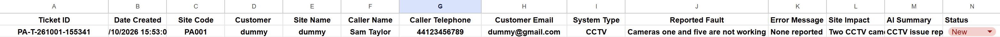
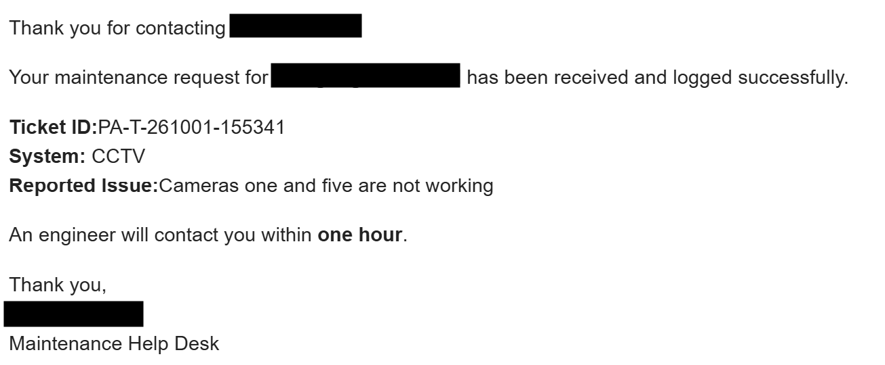
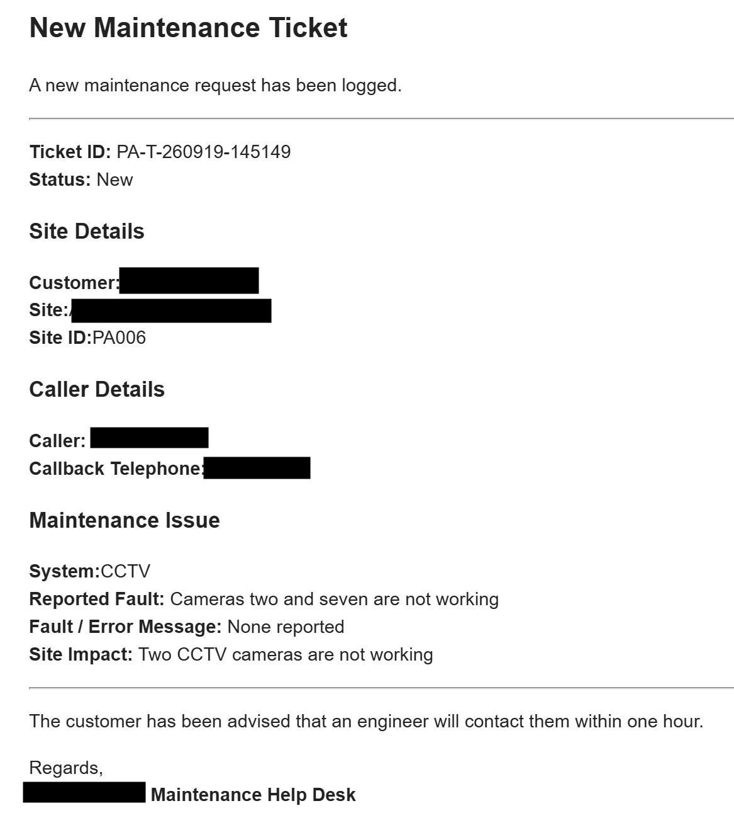

# AI Maintenance Help Desk Prototype

## About the project

I built this as a personal project to explore how a small maintenance business could make it easier to log and manage customer faults.

The idea came from a fairly common problem for small maintenance businesses. Customers may call or email with an issue while engineers are already out working on-site, which can make it difficult to respond straight away. Details may then need to be gathered manually, including which site the issue relates to, what the problem is, and who needs to follow it up.

I wanted to see how much of that first stage could be automated without making the experience difficult for either the customer or the business.

The prototype allows someone to report a maintenance issue in two ways:

- by speaking to an AI voice assistant over the phone
- by completing a simple online form

Both routes feed into the same ticketing process.

The aim was not just to create a chatbot, but to turn an unstructured maintenance request into structured data that could be validated, recorded and used by the rest of the workflow.

---

## What the prototype does

At a high level, the system:

1. identifies the customer site
2. validates the site against a maintained site list
3. captures the maintenance issue
4. identifies the type of system affected
5. records the caller and callback details
6. allows the information to be reviewed and corrected
7. creates a maintenance ticket
8. sends confirmation emails to the business and customer
9. records the ticket in a central register

A web form was also added as an alternative reporting route, using the same ticket creation process as the phone workflow.

---

## How the system works

The prototype has two ways of reporting a maintenance issue, but both routes eventually use the same ticket creation process.

### Phone route

```text
Customer calls maintenance number
        ↓
AI voice assistant answers
        ↓
Customer identifies the site
        ↓
Site is checked against the maintained site register
        ↓
Customer explains the maintenance issue
        ↓
AI extracts the relevant information
        ↓
Caller and callback details are collected
        ↓
Customer reviews and confirms the request
        ↓
Structured data is sent to the automation workflow
        ↓
Maintenance ticket is created
        ↓
Business and customer notifications are sent
        ↓
Ticket reference is returned to the caller
```

### Online form route

```text
Customer submits maintenance form
        ↓
Google Apps Script runs automatically
        ↓
Form answers are read
        ↓
Selected site is matched against the Sites register
        ↓
Official site information is retrieved
        ↓
Form data and reference data are combined
        ↓
Structured JSON payload is created
        ↓
Payload is sent to Make.com
        ↓
Existing ticket workflow runs
        ↓
Ticket is stored and notifications are sent
```

The main design decision was to avoid building separate ticketing processes for each input method.

Whether the request starts as a phone conversation or a form submission, it is converted into the same type of structured maintenance request before being passed into the ticket workflow.

---

# Project walkthrough

The screenshots below show the main parts of the working prototype, from the AI conversation through to site validation, ticket creation and automated notifications.

Sensitive customer and business information has been removed from the screenshots used in this public repository.

## 1. AI conversation flow



The Retell AI conversation flow manages the maintenance call.

It identifies the site, collects the maintenance issue, extracts structured fault information, records caller details, allows corrections and sends the confirmed request into the ticket workflow.

The AI is therefore doing more than simply having a conversation. It is collecting information that can be used as structured business data.

---

## 2. Site lookup workflow



The site lookup workflow receives the site information captured during the AI conversation.

It searches the maintained Sites register in Google Sheets and returns the matching information to the voice workflow.

```text
Caller provides site
        ↓
AI extracts site information
        ↓
Make.com receives lookup request
        ↓
Google Sheets is searched
        ↓
Matching site is returned
        ↓
AI confirms the site with the caller
```

This means the AI does not need to invent customer or site information.

---

## 3. Site reference data



The Sites table acts as the maintained reference source for customer locations.

The screenshot above uses a fictional example record. Real customer site information is not included in this repository.

| Field | Purpose |
|---|---|
| Site ID | Unique internal identifier |
| Site Name | Customer or organisation |
| Branch | Branch or location where required |
| Site Display Name | Name used when confirming the site |
| Telephone | Stored site contact number |
| Customer Email | Used for ticket confirmations |
| Address | Stored site address |

When the workflow identifies a site, it can retrieve trusted information from this table rather than relying entirely on what the caller has said.

---

## 4. Maintenance ticket workflow



The main Make.com workflow receives the structured maintenance request and coordinates the rest of the process.

It prepares the ticket data, creates the record in Google Sheets, retrieves business settings, checks Away Mode, sends notifications and returns confirmation to the calling workflow.

Make.com acts as the orchestration layer between the different services.

---

## 5. Structured ticket register



The information collected during the conversation is stored as a structured maintenance ticket.

Instead of keeping the issue only as a phone conversation or free-text message, the workflow produces separate fields for information such as:

- Ticket ID
- date created
- site
- caller
- callback telephone
- affected system
- reported fault
- fault or error message
- site impact
- AI summary
- status

This makes the information easier to track, search, filter and use in later automation.

---

## 6. Customer confirmation



Once the ticket has been created successfully, the customer receives a confirmation email containing the ticket reference, affected system, reported issue and expected follow-up time.

The AI does not tell the caller that a ticket has been created until the backend workflow has successfully returned confirmation.

---

## 7. Internal business notification



The business receives a more detailed notification containing the information needed to follow up the request.

Sensitive customer and business information has been redacted from the public screenshot.

---

## What the AI is actually doing

One of the most important parts of the project was turning normal conversation into structured information.

For example, a caller may say:

> “The camera at the front entrance isn't showing anything and we can't see people arriving.”

The AI can separate the useful information into fields:

| Information | Structured result |
|---|---|
| Affected system | CCTV |
| Reported fault | Front entrance camera not displaying |
| Site impact | Entrance cannot be monitored |

Other information is collected during the same conversation, including the site, Site ID, caller name and callback number.

Before the ticket is created, the caller is given an opportunity to review and correct the information.

---

## From unstructured to structured data

A key part of the project was transforming information from one form into another.

A customer may initially provide:

```text
"The front entrance camera is not displaying and we cannot see visitors arriving."
```

The workflow can turn that into:

```text
System Type
→ CCTV

Reported Fault
→ Front entrance camera not displaying

Site Impact
→ Entrance cannot be monitored
```

The overall data flow can be viewed as:

```text
Capture
   ↓
Extract
   ↓
Validate
   ↓
Enrich
   ↓
Structure
   ↓
Create record
   ↓
Notify
   ↓
Track
```

This was one of the main areas I wanted to explore through the project.

---

## Main technologies used

### Retell AI

Used for conversational voice intake.

Retell manages the phone conversation and extracts structured information from what the caller says.

### Twilio

Used as part of the telephony layer for the dedicated maintenance telephone number.

Twilio handles the telephone connection while Retell manages the AI conversation.

### Make.com

Used as the main workflow automation and orchestration layer.

Make.com connects the AI, reference data, ticket register, settings and notification process.

### Google Sheets

Used as a lightweight data store for the prototype.

The workbook contains separate areas for:

- Sites
- Tickets
- Settings
- Form Responses

### Google Forms

Used as an alternative way for someone to report a maintenance issue.

### Google Apps Script

Used to connect form submissions to the existing ticket workflow.

### Webhooks and JSON

Used to pass structured information between different systems.

---

## Google Form route

I also added a Google Form as an alternative way to report a maintenance issue.

The form collects information the user would normally know, such as:

- site
- affected system
- maintenance issue
- optional fault or error message
- site impact
- caller name
- callback telephone number

The user does not need to enter internal information such as a Site ID or stored customer email address.

Instead, Google Apps Script uses the selected site to look up the official record in the maintained Sites table.

The process is:

```text
Form submitted
        ↓
Google Apps Script runs automatically
        ↓
Form answers are read
        ↓
Selected site is matched against the Sites table
        ↓
Official site information is retrieved
        ↓
Form data and reference data are combined
        ↓
Structured JSON payload is created
        ↓
Payload is sent to Make.com
        ↓
Existing ticket workflow runs
        ↓
Ticket is stored and notifications are sent
```

This means the phone and form routes use different ways of collecting information, but both are converted into the same type of structured maintenance request before reaching the main ticket workflow.

This was useful because I only needed to maintain one core ticket creation process rather than building a separate backend workflow for each input method.

For the full technical breakdown, including the Apps Script, trigger setup, field mapping and debugging examples, see [Google Form Integration](docs/form-integration.md).

---

## Configurable Away Mode

The prototype also includes a simple Away Mode.

A Settings table stores values such as:

```text
Primary business email
Away Mode
Alternative email
```

When Away Mode is disabled:

```text
Business notification
        +
Customer confirmation
```

When Away Mode is enabled:

```text
Business notification
        +
Customer confirmation
        +
Additional alternative email
```

This means the routing behaviour can be changed through a setting rather than editing the Make.com workflow.

---

## Testing and debugging

A large part of the project involved testing how information moved between the different systems.

Two useful examples were the customer email mapping issue and duplicate form submissions.

### Incorrect customer email mapping

During the Google Form integration, the customer email field was initially mapped to the wrong spreadsheet column.

This resulted in a postal address being passed into the email recipient field.

I traced the data through the automation:

```text
Email fails
        ↓
Inspect email recipient in Make.com
        ↓
Notice postal address instead of email address
        ↓
Inspect incoming payload
        ↓
Trace value back to Apps Script
        ↓
Find incorrect spreadsheet column index
        ↓
Correct mapping
```

This was a useful example of why data mapping is important when connecting different systems.

### Duplicate ticket creation

During another test, one form submission created two identical maintenance tickets.

The issue was traced to two identical Google Apps Script form submission triggers.

```text
One form submission
        ↓
Two triggers
        ↓
Two script executions
        ↓
Two Make.com requests
        ↓
Two tickets
```

Removing the duplicate trigger restored the intended behaviour:

```text
One form submission
        ↓
One trigger
        ↓
One script execution
        ↓
One automation execution
        ↓
One ticket
```

These issues reinforced the importance of tracing both data and events through an end-to-end workflow.

---

## Security considerations

The prototype deals with maintenance requests that can involve security and life-safety systems.

The AI was therefore deliberately restricted.

The voice assistant is not intended to:

- provide alarm or engineer codes
- reveal passwords or security credentials
- explain how to bypass a security system
- provide instructions for disabling security or life-safety equipment
- invent missing site information

The AI's role is maintenance intake and ticket creation rather than detailed technical troubleshooting.

The system also avoids confirming that a ticket has been created until the backend automation has successfully returned a ticket reference.

---

## Prototype vs production

This project is a personal proof of concept rather than a production deployment.

Tools such as Google Sheets, Google Forms and Make.com were useful because they allowed me to build and test the complete workflow quickly and at relatively low cost.

For a production implementation, I would review areas such as:

- database or service-management platform integration
- authentication and role-based access
- secrets management
- monitoring and logging
- retry and failure handling
- duplicate-request protection
- data retention
- audit history
- scalability
- CRM or help-desk integration
- SMS or WhatsApp notifications
- automated resolution notifications

The individual technologies could change while the overall architecture remains similar.

---

## What I learned

This project helped me understand how several areas work together in an end-to-end solution:

- conversational AI
- structured and unstructured data
- reference data
- data validation
- data enrichment
- data mapping
- APIs
- webhooks
- JSON payloads
- workflow automation
- conditional routing
- event-driven processing
- testing and debugging
- error handling
- business process design

One of the main things I learned was that the AI interface is only one part of the solution.

The reliability of the overall process depends on how the information is structured, validated, passed between systems and handled when something goes wrong.

---

## Project status

This is a personal proof-of-concept and portfolio project.

The current prototype successfully supports:

- AI-assisted phone intake
- site validation
- structured fault capture
- callback number capture
- caller review and corrections
- ticket creation
- customer and business email notifications
- configurable away-email routing
- Google Form submissions using the same ticket workflow

---

## Detailed documentation

More detailed technical documentation is available in the `docs` folder:

- [System Architecture](docs/architecture.md)
- [Google Form Integration](docs/form-integration.md)
- [Technical Glossary](docs/technical-glossary.md)

The Google Form documentation contains the detailed Apps Script explanation, including how the form values are read, how the Sites table is searched, how the payload is created, how the webhook request is sent and how the integration was debugged.

Further documentation may be added for the voice AI workflow, testing decisions and production considerations.

---

## Video walkthrough

A short walkthrough video will be added to this repository.

The video will demonstrate:

- the AI answering a maintenance call
- site identification and validation
- natural-language fault reporting
- structured information capture
- ticket creation
- customer confirmation
- internal business notification
- how the different parts of the architecture work together

The walkthrough will use a controlled demonstration and will not expose customer information, credentials or private integration endpoints.

---

## Privacy

This repository documents the design and implementation of the prototype without publishing customer or business-sensitive information.

Real customer names, addresses, telephone numbers, email addresses, maintenance records, call recordings, webhook URLs, credentials and integration secrets are intentionally excluded or redacted.

Where screenshots are included, sensitive information has been removed before publication.
